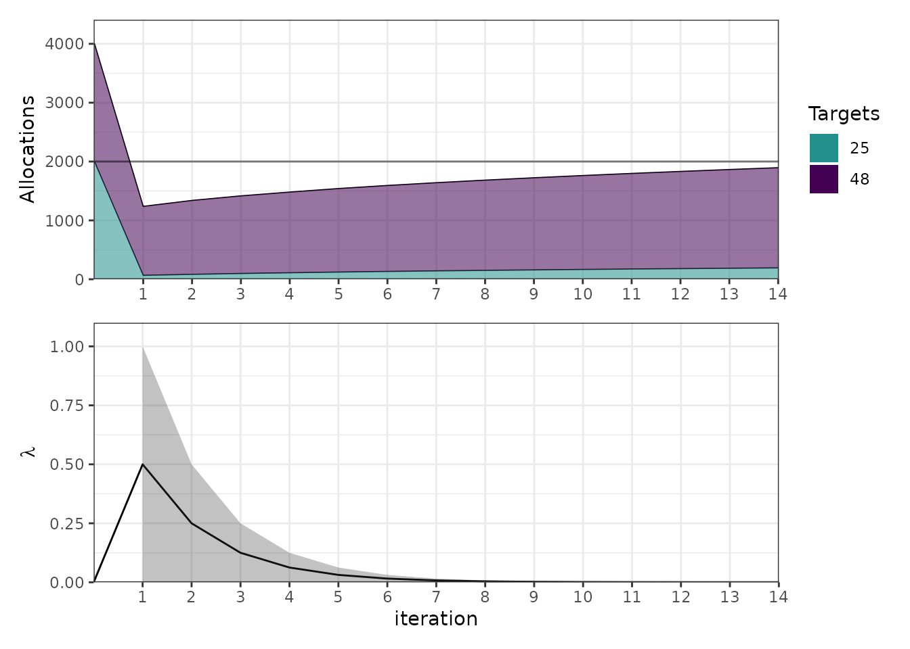
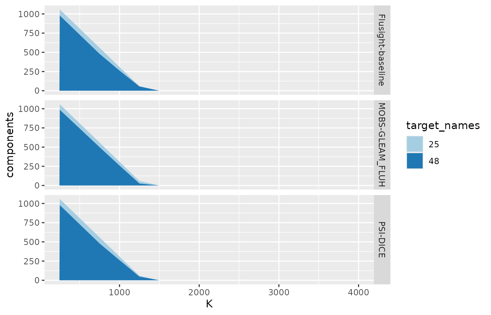

# Scoring hubverse forecasts by what they would allocate

``` r

library(alloscore2)
library(dplyr)
```

## Acknowledgment

This vignette adapts content from [the original `alloscore`
package](https://github.com/aaronger/alloscore) written by Aaron
Gerding. It was drafted by Claude Code (Opus 5) and reviewed for
accuracy by Nick Reich.

## The idea

Most forecast scores judge each prediction on its own. An allocation
score instead asks what a whole vector of forecasts would have led you
to *do* with a scarce resource, and then charges you for the
consequences.

Concretely: you have forecasts for $`N`$ targets and a budget $`K`$. You
allocate $`x_i`$ to target $`i`$, paying $`w_i`$ per unit, so that
$`\sum_i w_i x_i \le K`$. When the outcomes $`y_i`$ arrive, you incur a
generalized piecewise linear loss

``` math
L_i(x_i, y_i) = \kappa_i \left[ (1-\alpha_i)(x_i - y_i)_+ + \alpha_i (y_i - x_i)_+ \right],
```

which with $`\alpha_i`$ near 1 punishes falling short much harder than
overshooting. Note also that $`\kappa_i`$ scales that loss — the cost
per unit of error at target $`i`$ — so the pair splits into an over-cost
$`\kappa_i(1-\alpha_i)`$ and an under-cost $`\kappa_i\alpha_i`$. Both
$`\alpha_i`$ and $`\kappa_i`$ default to 1 in this package’s
computations.

The score is the loss your allocation incurred, minus the loss of an
allocation made by an oracle who knew the outcomes:

``` math
S = \sum_i L_i(x_i, y_i) - \sum_i L_i(x_i^{\text{oracle}}, y_i).
```

Because the budget is shared, this rewards getting the *relative* burden
across targets right.

## Looking at some forecast data

The forecast data in `hubExamples` is a standard hubverse
`model_out_tbl`. We filter to the quantile output type, which is the one
`alloscore2` supports.

``` r

model_out <- hubExamples::forecast_outputs |>
  filter(output_type == "quantile")
oracle_output <- hubExamples::forecast_oracle_output

model_out |>
  select(model_id, reference_date, horizon, location, output_type_id, value) |>
  head()
#> # A tibble: 6 × 6
#>   model_id          reference_date horizon location output_type_id value
#>   <chr>             <date>           <int> <chr>    <chr>          <dbl>
#> 1 Flusight-baseline 2022-11-19           0 25       0.05              22
#> 2 Flusight-baseline 2022-11-19           0 25       0.1               31
#> 3 Flusight-baseline 2022-11-19           0 25       0.25              45
#> 4 Flusight-baseline 2022-11-19           0 25       0.5               51
#> 5 Flusight-baseline 2022-11-19           0 25       0.75              57
#> 6 Flusight-baseline 2022-11-19           0 25       0.9               71
```

### What’s in the example data

[`hubExamples::forecast_outputs`](https://rdrr.io/pkg/hubExamples/man/forecast_data.html)
is a small slice of a FluSight-style hub: three models forecasting
weekly incident influenza hospitalizations in two states, FIPS 25
(Massachusetts) and 48 (Texas), from two reference dates in the 2022–23
season, at horizons 0 to 3 weeks ahead. Each forecast has seven
predictive quantiles.

``` r

model_out |>
  select(model_id, target, location, reference_date, horizon, output_type_id) |>
  tidyr::pivot_longer(
    everything(),
    names_to = "column",
    values_transform = as.character
  ) |>
  summarise(
    n = n_distinct(value),
    values = paste(sort(unique(value)), collapse = ", "),
    .by = column
  )
#> # A tibble: 6 × 3
#>   column             n values                                      
#>   <chr>          <int> <chr>                                       
#> 1 model_id           3 Flusight-baseline, MOBS-GLEAM_FLUH, PSI-DICE
#> 2 target             1 wk inc flu hosp                             
#> 3 location           2 25, 48                                      
#> 4 reference_date     2 2022-11-19, 2022-12-17                      
#> 5 horizon            4 0, 1, 2, 3                                  
#> 6 output_type_id     7 0.05, 0.1, 0.25, 0.5, 0.75, 0.9, 0.95
```

That is $`3 \times 1 \times 2 \times 2 \times 4 \times 7 = 336`$ rows.
Each (model, reference date, horizon) combination therefore covers
exactly two locations, and those two are the set that will share a
budget below.

The observed outcomes come from
[`hubExamples::forecast_oracle_output`](https://rdrr.io/pkg/hubExamples/man/forecast_data.html),
the full FluSight target series for every location and week;
[`as_alloscore_df()`](https://reichlab.io/alloscore2/reference/as_alloscore_df.md)
joins in only the rows it needs, matching on `target`, `target_end_date`
and `location`. For the weeks these forecasts cover:

``` r

oracle_output |>
  filter(
    output_type == "quantile",
    location %in% unique(model_out$location),
    target_end_date %in% unique(model_out$target_end_date)
  ) |>
  select(location, target_end_date, oracle_value) |>
  tidyr::pivot_wider(
    names_from = location, values_from = oracle_value, names_prefix = "loc_"
  )
#> # A tibble: 8 × 3
#>   target_end_date loc_25 loc_48
#>   <date>           <dbl>  <dbl>
#> 1 2022-11-19          79   1230
#> 2 2022-11-26         221   1929
#> 3 2022-12-03         446   2139
#> 4 2022-12-10         578   1781
#> 5 2022-12-17         694   1462
#> 6 2022-12-24         769   1225
#> 7 2022-12-31         733   1434
#> 8 2023-01-07         466   1170
```

Texas runs roughly three to fifteen times Massachusetts week to week,
and the two together range from about 1,300 to 2,600 hospitalizations.
That is the scale to keep in mind when reading budgets: $`K = 500`$ is
severely binding, while $`K = 4000`$ covers any week outright.

### Choosing what shares a budget

This is the one modeling decision the package cannot make for you. An
allocation problem is a *set* of targets competing for one budget, so
you have to say which task ID columns enumerate that set. Here we pool
across locations, so `target_cols = "location"`.

Everything else — `model_id` plus the remaining task IDs — becomes the
*allocation unit*, and one allocation problem is solved per combination.
This follows the same logic as a hubverse `compound_taskid_set`: the
columns you name vary within a group, and the rest are held constant. In
the example below, we are preparing to make allocations based on the
forecasts from the model in `model_id`, made for all the locations at a
specific `reference_date`, `target`, `horizon` and `target_end_date`.

``` r

adf <- as_alloscore_df(model_out, oracle_output, target_cols = "location")
adf
#> # A tibble: 24 × 6
#>    model_id          reference_date target     horizon target_end_date forecasts
#>  * <chr>             <date>         <chr>        <int> <date>          <list>   
#>  1 Flusight-baseline 2022-11-19     wk inc fl…       0 2022-11-19      <tibble> 
#>  2 Flusight-baseline 2022-11-19     wk inc fl…       1 2022-11-26      <tibble> 
#>  3 Flusight-baseline 2022-11-19     wk inc fl…       2 2022-12-03      <tibble> 
#>  4 Flusight-baseline 2022-11-19     wk inc fl…       3 2022-12-10      <tibble> 
#>  5 Flusight-baseline 2022-12-17     wk inc fl…       0 2022-12-17      <tibble> 
#>  6 Flusight-baseline 2022-12-17     wk inc fl…       1 2022-12-24      <tibble> 
#>  7 Flusight-baseline 2022-12-17     wk inc fl…       2 2022-12-31      <tibble> 
#>  8 Flusight-baseline 2022-12-17     wk inc fl…       3 2023-01-07      <tibble> 
#>  9 MOBS-GLEAM_FLUH   2022-11-19     wk inc fl…       0 2022-11-19      <tibble> 
#> 10 MOBS-GLEAM_FLUH   2022-11-19     wk inc fl…       1 2022-11-26      <tibble> 
#> # ℹ 14 more rows
```

Each row in the table above holds one allocation problem. The
`forecasts` column has a row per target, with the predictive quantiles
(`ps`, `qs`), a cdf `F` and quantile function `Q` interpolated through
them by [distfromq](https://reichlab.io/distfromq/), and the observed
outcome `y`:

``` r

adf$forecasts[[1]] |> select(location, y, ps, qs)
#> # A tibble: 2 × 4
#>   location     y ps        qs       
#>   <chr>    <dbl> <list>    <list>   
#> 1 25          79 <dbl [7]> <dbl [7]>
#> 2 48        1230 <dbl [7]> <dbl [7]>
adf$forecasts[[1]]$F[[1]](100)
#> [1] 0.9929005
```

Above, `adf$forecasts[[1]]$F[[1]]` is the cumulative distribution
function of the first target’s predictive distribution, fit by
`distfromq` through that row’s ps/qs pairs — you call it at a value on
the outcome scale and it returns the forecast probability that the
outcome falls at or below that value. So the printed value above is
`F[[1]]` evaluated at the value of 100, and can be read as “what
probability did this model put on location 25 seeing 100 or fewer?”. And
Q\[\[1\]\] is its inverse, taking a probability in $`[0,1]`$ back to the
outcome scale.

Note that you rarely need to call
[`as_alloscore_df()`](https://reichlab.io/alloscore2/reference/as_alloscore_df.md)
yourself — it is what
[`alloscore_model_out()`](https://reichlab.io/alloscore2/reference/alloscore_model_out.md)
does internally — but it is the place to look when a join or a target
set is not what you expected.

## Allocating without scoring

If you have a forecast and a budget but don’t have the eventual
observations to score against yet, you can use
[`allocate_model_out()`](https://reichlab.io/alloscore2/reference/allocate_model_out.md),
which stops after the allocation step. This is useful when the question
is what a forecast implies you should do rather than how good it was:

``` r

allocate_model_out(
  model_out_tbl = filter(model_out, reference_date == "2022-11-19", horizon == 0),
  K = 1000,
  target_cols = "location"
) |>
  select(model_id, K, xdf) |>
  mutate(allocations = purrr::map(xdf, ~ select(.x, target_names, x))) |>
  select(-xdf) |>
  tidyr::unnest(allocations)
#> # A tibble: 6 × 4
#>   model_id              K target_names     x
#>   <chr>             <dbl> <chr>        <dbl>
#> 1 Flusight-baseline  1000 25            32.3
#> 2 Flusight-baseline  1000 48           968. 
#> 3 MOBS-GLEAM_FLUH    1000 25            30.2
#> 4 MOBS-GLEAM_FLUH    1000 48           970. 
#> 5 PSI-DICE           1000 25            32.5
#> 6 PSI-DICE           1000 48           967.
```

In the above output, `x` is the column giving you the suggested
allocations from each model for each location.

## Allocation scores

However, the focus of this package is on scoring different choices of
allocations based on a model’s forecast. Here is code to do that, for a
variety of different budgets $`K`$.

``` r

scores <- alloscore_model_out(
  model_out_tbl = model_out,
  oracle_output = oracle_output,
  K = c(500, 1000, 2000, 4000),
  target_cols = "location",
  by = c("model_id", "K")
)
scores
#> # A tibble: 12 × 6
#>    model_id              K    score score_raw score_oracle  ytot
#>    <chr>             <dbl>    <dbl>     <dbl>        <dbl> <dbl>
#>  1 Flusight-baseline   500 -0.00553     1544.        1544. 2044.
#>  2 Flusight-baseline  1000  0.342       1045.        1044. 2044.
#>  3 Flusight-baseline  2000 50.7          228.         177. 2044.
#>  4 Flusight-baseline  4000  0              0            0  2044.
#>  5 MOBS-GLEAM_FLUH     500 -0.427       1544.        1544. 2044.
#>  6 MOBS-GLEAM_FLUH    1000 -0.464       1044.        1044. 2044.
#>  7 MOBS-GLEAM_FLUH    2000 29.4          207.         177. 2044.
#>  8 MOBS-GLEAM_FLUH    4000  0              0            0  2044.
#>  9 PSI-DICE            500 -0.173       1544.        1544. 2044.
#> 10 PSI-DICE           1000 -0.263       1044.        1044. 2044.
#> 11 PSI-DICE           2000 53.1          230.         177. 2044.
#> 12 PSI-DICE           4000  0              0            0  2044.
```

Smaller scores are better. Note the `ytot` column: the total outcome
across the pooled locations. Once $`K`$ exceeds it the oracle can cover
everything and its loss falls to zero, so differences between models
become differences in how well they spent a budget that was never really
binding.

Note that scores are differences of losses against an oracle, so they in
theory should never be below zero. However, small negative values can
occur in practice (see results above) as an artifact of the `eps_K`
argument to
[`allocate()`](https://reichlab.io/alloscore2/reference/allocate.md) or
[`alloscore_model_out()`](https://reichlab.io/alloscore2/reference/alloscore_model_out.md),
which lets the forecaster’s allocation overspend the budget by up to 1%
while the oracle is held to $`K`$ exactly, and it shrinks toward zero as
you tighten that tolerance.

### Digging into per-target details

With `summarize = FALSE` you get one row per allocation problem and
budget, plus a nested `xdf` holding the allocation, outcome and loss for
each target.

``` r

detail <- alloscore_model_out(
  model_out_tbl = model_out,
  oracle_output = oracle_output,
  K = 2000,
  target_cols = "location",
  summarize = FALSE
)
detail |> select(model_id, reference_date, horizon, K, score, xdf)
#> # A tibble: 24 × 6
#>    model_id          reference_date horizon     K     score xdf             
#>    <chr>             <date>           <int> <dbl>     <dbl> <list>          
#>  1 Flusight-baseline 2022-11-19           0  2000  0        <tibble [2 × 8]>
#>  2 Flusight-baseline 2022-11-19           1  2000  1.35e+ 1 <tibble [2 × 8]>
#>  3 Flusight-baseline 2022-11-19           2  2000  1.14e-13 <tibble [2 × 8]>
#>  4 Flusight-baseline 2022-11-19           3  2000  6.82e-13 <tibble [2 × 8]>
#>  5 Flusight-baseline 2022-12-17           0  2000  3.46e+ 1 <tibble [2 × 8]>
#>  6 Flusight-baseline 2022-12-17           1  2000  2.86e+ 2 <tibble [2 × 8]>
#>  7 Flusight-baseline 2022-12-17           2  2000  7.16e+ 1 <tibble [2 × 8]>
#>  8 Flusight-baseline 2022-12-17           3  2000  0        <tibble [2 × 8]>
#>  9 MOBS-GLEAM_FLUH   2022-11-19           0  2000  0        <tibble [2 × 8]>
#> 10 MOBS-GLEAM_FLUH   2022-11-19           1  2000 -2.07e-12 <tibble [2 × 8]>
#> # ℹ 14 more rows
detail$xdf[[2]]
#> # A tibble: 2 × 8
#>   target_names     x score_fun     y oracle components_raw components_oracle
#>   <chr>        <dbl> <list>    <dbl>  <dbl>          <dbl>             <dbl>
#> 1 25            234. <fn>        221   206.             0               15.4
#> 2 48           1766. <fn>       1929  1794.           163.             135. 
#> # ℹ 1 more variable: components <dbl>
```

The `components` column is each target’s contribution to the overall
allocation score. In the above case, the model’s total shortfall was 163
against the oracle’s 150, and the 13-unit gap (the `score` in row 2 of
the detail tibble) is precisely what it overspent on location 25 (234
against a need of 221). With alpha = 1, a binding budget makes the score
simply the budget wasted on targets that didn’t need it — overshooting
25 is not penalized directly (its `components_raw` is 0), but it is
penalized because those units were unavailable to location 48.

## Costs that differ by target

`w` is the cost of a unit allocated to a target. It can be a scalar, a
vector named by target, or the name of a column of the model output.
Making one location more expensive shifts the allocation away from it:

``` r

one_round <- model_out |>
  filter(reference_date == "2022-11-19", horizon == 0)

bind_rows(
  allocate_model_out(one_round, K = 1000, target_cols = "location") |>
    mutate(weighting = "equal cost"),
  allocate_model_out(
    one_round,
    K = 1000, target_cols = "location", w = c("25" = 1, "48" = 5)
  ) |>
    mutate(weighting = "location 48 five times dearer")
) |>
  select(weighting, model_id, xdf) |>
  mutate(alloc = purrr::map(xdf, ~ select(.x, target_names, x))) |>
  select(-xdf) |>
  tidyr::unnest(alloc) |>
  tidyr::pivot_wider(names_from = target_names, values_from = x)
#> # A tibble: 6 × 4
#>   weighting                     model_id           `25`  `48`
#>   <chr>                         <chr>             <dbl> <dbl>
#> 1 equal cost                    Flusight-baseline  32.3  968.
#> 2 equal cost                    MOBS-GLEAM_FLUH    30.2  970.
#> 3 equal cost                    PSI-DICE           32.5  967.
#> 4 location 48 five times dearer Flusight-baseline  59.3  188.
#> 5 location 48 five times dearer MOBS-GLEAM_FLUH    52.1  190.
#> 6 location 48 five times dearer PSI-DICE           87.8  182.
```

Every row spends the full budget of 1000, but the arithmetic differs: in
the first three rows a unit costs 1 everywhere, so the two allocations
sum to 1000, while in the last three each unit at location 48 costs 5,
so `25` + 5 × `48` is 1000 and only about 250 units of resource are
deployed in total.

## How much it hurts to fall short

`alpha` is the quantile level of the underlying pinball loss, and it
encodes how asymmetric the consequences are. The unconstrained optimum
for a target is its `alpha`-quantile, so raising `alpha` buys more
insurance against shortfalls.

``` r

purrr::map(
  c(0.5, 0.8, 0.95, 1),
  function(a) {
    alloscore_model_out(
      one_round,
      oracle_output,
      K = 2000,
      target_cols = "location",
      alpha = a,
      by = "model_id"
    ) |>
      mutate(alpha = a)
  }
) |>
  purrr::list_rbind() |>
  select(alpha, model_id, score) |>
  tidyr::pivot_wider(names_from = model_id, values_from = score)
#> # A tibble: 4 × 4
#>   alpha `Flusight-baseline` `MOBS-GLEAM_FLUH` `PSI-DICE`
#>   <dbl>               <dbl>             <dbl>      <dbl>
#> 1  0.5                103                47        35.5 
#> 2  0.8                134.               25.9      11.4 
#> 3  0.95                29.5              19.7       9.65
#> 4  1                    0                 0         0
```

The above results show that PSI-DICE allocates best at every asymmetry
level, Flusight-baseline worst — by a widening margin as alpha rises,
since its tight, low predictive distributions leave shortfalls that grow
costlier — while at alpha = 1 all three score zero because the unbounded
optimum makes each spend the full budget, which at $`K = 2000`$ covers
this week’s total of 1309 outright.

## Looking inside the optimization

The allocation is found by bisecting on a single Lagrange multiplier
$`\lambda`$, the shadow price of the budget. At the optimum every target
that receives anything has the same marginal expected benefit, and each
allocation is that target’s predictive quantile at a level discounted by
$`\lambda`$.
[`plot_iterations()`](https://reichlab.io/alloscore2/reference/plot_iterations.md)
shows that search.

``` r

alloc <- allocate_model_out(one_round, K = 2000, target_cols = "location")
plot_iterations(dplyr::filter(alloc, model_id == "PSI-DICE"), K_to_plot = 2000)
#> Warning: Removed 1 row containing missing values or values outside the scale range
#> (`geom_ribbon()`).
```



The upper panel stacks the allocations, with the horizontal line at the
budget; the lower panel tracks $`\lambda`$ and the interval bracketing
it.

Loosely, $`\lambda`$ is what one more unit of budget would be worth —
how much expected loss it would save — so it is large when the budget is
tight and falls to zero once the budget stops binding. With equal costs
and weights it also has a direct reading: instead of covering each
target up to its $`\alpha`$-quantile, you can only afford its
$`(\alpha - \lambda)`$-quantile, and $`\lambda`$ is the same for every
target that gets anything. At $`\alpha = 0.95`$ and $`\lambda = 0.1`$,
each location is stocked to its 85th percentile rather than its 95th.

## Score decomposition

[`plot_components_slim()`](https://reichlab.io/alloscore2/reference/plot_components_slim.md)
shows which targets a score came from. Over a grid of budgets it stacks
each target’s contribution.

``` r

scored <- alloscore_model_out(
  model_out_tbl = one_round,
  oracle_output = oracle_output,
  K = seq(250, 4000, by = 250),
  target_cols = "location",
  summarize = FALSE
)
plot_components_slim(
  scored,
  model_col_name = "model_id",
  show_oracle = FALSE
)
```



## Scoring outside the hubverse

The core functions take forecasts as a data frame with one row per
target and list columns of cdfs and quantile functions, which
[`add_pdqr_funs()`](https://reichlab.io/alloscore2/reference/add_pdqr_funs.md)
builds from parameter columns for any distribution R knows.

``` r

forecasts <- add_pdqr_funs(
  tibble::tibble(
    target_names = c("a", "b", "c"),
    dist = "norm",
    mean = c(5, 8, 12),
    sd = c(1, 2, 3)
  ),
  types = c("p", "q")
)
alloscore(forecasts, y = c(4, 9, 11), K = c(10, 20, 30)) |>
  select(K, score, score_raw, score_oracle, ytot)
#> # A tibble: 3 × 5
#>       K  score score_raw score_oracle  ytot
#>   <dbl>  <dbl>     <dbl>        <dbl> <dbl>
#> 1    10 0.0154     14.0            14    24
#> 2    20 0.167       4.17            4    24
#> 3    30 0           0               0    24
```

For Monte Carlo work — one allocation scored against many simulated
outcome vectors —
[`slim()`](https://reichlab.io/alloscore2/reference/slim.md) strips the
allocation down to what scoring needs, and
[`alloscore()`](https://reichlab.io/alloscore2/reference/alloscore.md)
then accepts a list of outcome vectors.

``` r

alloc <- slim(allocate(forecasts, K = c(10, 20, 30)))
ys <- withr::with_seed(42, {
  purrr::map(1:50, function(i) {
    rlang::set_names(rexp(3, rate = 1 / 8), c("a", "b", "c"))
  })
})
mc <- alloscore(alloc, ys)
mc |>
  select(samp, scores) |>
  tidyr::unnest(scores) |>
  group_by(K) |>
  summarise(mean_score = mean(score), sd_score = sd(score), .groups = "drop")
#> # A tibble: 3 × 3
#>       K mean_score sd_score
#>   <dbl>      <dbl>    <dbl>
#> 1    10       1.14     1.50
#> 2    20       2.50     3.24
#> 3    30       3.40     4.94
```

## Caveats

- Only the `quantile` output type is supported. Scoring `sample` output,
  which would let the allocation respect dependence across targets
  rather than working from marginals, is not implemented.
- The budget constraint is enforced only to within `eps_K`, 1% by
  default. An allocation may therefore overspend slightly, and since the
  oracle is held to the budget exactly, a score can come out marginally
  negative. Tighten `eps_K` if that matters for your application.
- [`oracle_allocate()`](https://reichlab.io/alloscore2/reference/oracle_allocate.md)
  spends the whole budget even when the oracle has no use for it, so the
  oracle allocation it reports is inflated for generous budgets. The
  oracle’s *loss*, and hence the score, is unaffected.
