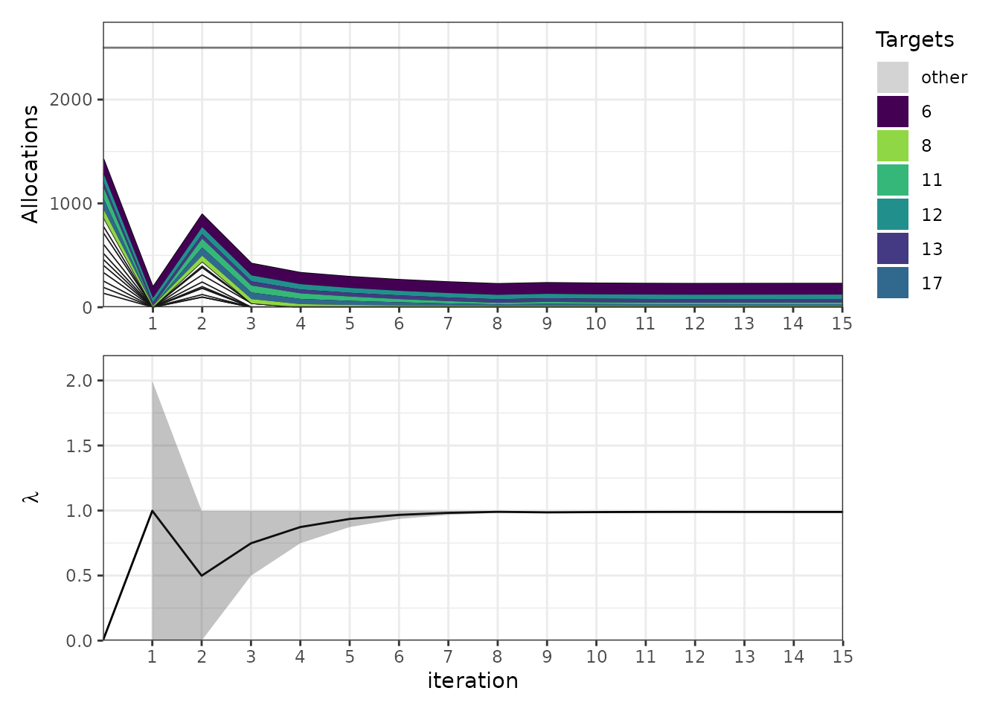

# Validation against published newsvendor optima

``` r

library(alloscore2)
library(dplyr)
library(purrr)
```

## Acknowledgment

This vignette adapts content from [the original `alloscore`
package](https://github.com/aaronger/alloscore) written by Aaron
Gerding, specifically from [a
vignette](https://github.com/aaronger/alloscore/blob/main/vignettes/zxh_demo.Rmd)
that shows how to reproduce results from Zhang, Xu and Hua (2009).

This vignette was drafted by Claude Code (Opus 5) and reviewed for
accuracy by Nick Reich.

## Why the newsvendor problem

The optimization inside \[allocate()\] is not specific to forecast
evaluation. It solves a budget-constrained separable convex program, and
one classical instance of that is the *multiproduct newsboy problem with
a budget constraint*: choose stock levels for several products, under
uncertain demand, subject to a limit on total purchasing cost.

That is useful here because the problem has a published literature with
reported optima. Zhang, Xu and Hua (2009) give two worked examples, and
this package ships their data in `zxh_tab2` and `zxh_tab3`. Reproducing
their `Opt` column checks
[`allocate()`](https://reichlab.io/alloscore2/reference/allocate.md)
against an external source rather than against the package’s own
history.

``` r

zxh_tab2
#>    Product  v h  c  mu sigma  q_zxh    GIM    Opt
#> 1        1  7 1  4 102  51.0  85.75   0.00   0.00
#> 2        2 12 2  8  73  18.3  62.64   0.00   0.00
#> 3        3 30 4 19 123  30.8 108.90   0.00   0.00
#> 4        4 30 4 17  95  23.8  87.88   0.00   0.00
#> 5        5 40 2 23  62  15.5  58.26   0.00   0.00
#> 6        6 45 5 15 129  43.0 139.89 106.86 106.85
#> 7        7 16 1 10  69  34.5  55.98   0.00   0.00
#> 8        8 21 2 10  83  41.5  80.74  14.02  14.01
#> 9        9 42 3 40 120  30.0  68.96   0.00   0.00
#> 10      10 34 5 20  89  22.3  80.95   0.00   0.00
#> 11      11 20 3 10 115  38.3 108.71  15.58  15.65
#> 12      12 15 5  7  91  30.3  83.32  42.20  42.25
#> 13      13 10 3  4  52  17.3  50.33  34.56  34.60
#> 14      14 20 3 12  76  38.0  61.14   0.00   0.00
#> 15      15 47 2 33  66  16.5  56.66   0.00   0.00
#> 16      16 35 4 21 147  36.8 133.71   0.00   0.00
#> 17      17 22 1 11 104  34.7 102.11  15.23  15.13
```

## From newsvendor costs to gpl parameters

The newsvendor parameterization uses three costs per product: `c` per
unit purchased, `v` per unit of unmet demand, and `h` per unit left
over. The gpl loss instead uses a scale `kappa` and a level `alpha`.
[`stdize_news_params()`](https://reichlab.io/alloscore2/reference/stdize_news_params.md)
converts between them, giving

``` math
\kappa = h + v, \qquad \alpha = \frac{v - c}{h + v}.
```

The `alpha` that falls out is the newsvendor’s familiar critical ratio,
and the unconstrained optimum is the `alpha`-quantile of demand.

``` r

zxh_norm <- zxh_tab2 |>
  mutate(stdize_news_params(ax = c, a_minus = v, a_plus = h), .after = c) |>
  as_tibble()
zxh_norm |> select(Product, c, v, h, kappa, alpha, q_zxh)
#> # A tibble: 17 × 7
#>    Product     c     v     h kappa  alpha q_zxh
#>    <chr>   <int> <int> <int> <dbl>  <dbl> <dbl>
#>  1 1           4     7     1     8 0.375   85.8
#>  2 2           8    12     2    14 0.286   62.6
#>  3 3          19    30     4    34 0.324  109. 
#>  4 4          17    30     4    34 0.382   87.9
#>  5 5          23    40     2    42 0.405   58.3
#>  6 6          15    45     5    50 0.6    140. 
#>  7 7          10    16     1    17 0.353   56.0
#>  8 8          10    21     2    23 0.478   80.7
#>  9 9          40    42     3    45 0.0444  69.0
#> 10 10         20    34     5    39 0.359   81.0
#> 11 11         10    20     3    23 0.435  109. 
#> 12 12          7    15     5    20 0.4     83.3
#> 13 13          4    10     3    13 0.462   50.3
#> 14 14         12    20     3    23 0.348   61.1
#> 15 15         33    47     2    49 0.286   56.7
#> 16 16         21    35     4    39 0.359  134. 
#> 17 17         11    22     1    23 0.478  102.
```

## Building the demand distributions

Demand is Normal here, so
[`add_pdqr_funs()`](https://reichlab.io/alloscore2/reference/add_pdqr_funs.md)
builds the cdf and quantile function from `mean` and `sd` columns.
Evaluating each quantile function at its own `alpha` should recover the
critical quantile that Zhang, Xu and Hua print in `q_zxh`.

``` r

zxh_norm_forecasts <- zxh_norm |>
  rename(mean = mu, sd = sigma) |>
  add_pdqr_funs(dist = "norm", types = c("p", "q")) |>
  mutate(q_ours = map2_dbl(Q, alpha, function(Q, alpha) Q(alpha)))

zxh_norm_forecasts |>
  select(Product, alpha, q_zxh, q_ours) |>
  mutate(difference = q_ours - q_zxh)
#> # A tibble: 17 × 5
#>    Product  alpha q_zxh q_ours difference
#>    <chr>    <dbl> <dbl>  <dbl>      <dbl>
#>  1 1       0.375   85.8   85.7 -0.000608 
#>  2 2       0.286   62.6   62.6  0.00314  
#>  3 3       0.324  109.   109.  -0.00184  
#>  4 4       0.382   87.9   87.9 -0.00350  
#>  5 5       0.405   58.3   58.3  0.00387  
#>  6 6       0.6    140.   140.   0.00393  
#>  7 7       0.353   56.0   56.0 -0.0000221
#>  8 8       0.478   80.7   80.7 -0.00253  
#>  9 9       0.0444  69.0   69.0  0.00135  
#> 10 10      0.359   81.0   80.9 -0.00480  
#> 11 11      0.435  109.   109.   0.000727 
#> 12 12      0.4     83.3   83.3  0.00358  
#> 13 13      0.462   50.3   50.3 -0.000464 
#> 14 14      0.348   61.1   61.1 -0.00546  
#> 15 15      0.286   56.7   56.7  0.00184  
#> 16 16      0.359  134.   134.  -0.00222  
#> 17 17      0.478  102.   102.  -0.00181
```

## Allocating under the budget

Zhang, Xu and Hua use a budget of 2500, with the unit cost `c` as the
weight in the constraint. Passing `w = "c"` tells
[`allocate()`](https://reichlab.io/alloscore2/reference/allocate.md) to
take the weights from that column, and `target_names = "Product"` names
the targets from another.

``` r

allo_norm <- allocate(
  zxh_norm_forecasts,
  w = "c",
  K = 2500,
  target_names = "Product"
)

comparison <- zxh_norm_forecasts |>
  select(Product, c, GIM, Opt) |>
  left_join(allo_norm$xdf[[1]], by = "Product") |>
  select(Product, c, GIM, Opt, ours = x) |>
  mutate(difference = ours - Opt)
comparison
#> # A tibble: 17 × 6
#>    Product     c   GIM   Opt  ours difference
#>    <chr>   <int> <dbl> <dbl> <dbl>      <dbl>
#>  1 1           4   0     0     0      0      
#>  2 2           8   0     0     0      0      
#>  3 3          19   0     0     0      0      
#>  4 4          17   0     0     0      0      
#>  5 5          23   0     0     0      0      
#>  6 6          15 107.  107.  107.     0.00635
#>  7 7          10   0     0     0      0      
#>  8 8          10  14.0  14.0  14.0    0.0113 
#>  9 9          40   0     0     0      0      
#> 10 10         20   0     0     0      0      
#> 11 11         10  15.6  15.6  15.7    0.0573 
#> 12 12          7  42.2  42.2  42.3    0.00483
#> 13 13          4  34.6  34.6  34.6   -0.00307
#> 14 14         12   0     0     0      0      
#> 15 15         33   0     0     0      0      
#> 16 16         21   0     0     0      0      
#> 17 17         11  15.2  15.1  15.2    0.0547
```

Two things to note. Only 6 of the 17 products are stocked at all, and
they are exactly the 6 that Zhang, Xu and Hua stock — the budget binds
hard enough that most products are shut out entirely, which is a useful
test of the boundary handling. And the agreement is to within about a
twentieth of a unit:

``` r

c(
  max_abs_difference = max(abs(comparison$difference)),
  budget_spent = sum(comparison$c * comparison$ours),
  budget_available = 2500,
  n_stocked_ours = sum(comparison$ours > 1e-8),
  n_stocked_zxh = sum(comparison$Opt > 0)
)
#> max_abs_difference       budget_spent   budget_available     n_stocked_ours 
#>       5.733212e-02       2.501335e+03       2.500000e+03       6.000000e+00 
#>      n_stocked_zxh 
#>       6.000000e+00
```

The budget is spent to slightly over 2500. That is the `eps_K`
tolerance, 1% by default: the bisection stops once the constraint is
satisfied to within that relative tolerance rather than exactly.

## Comparing objective values

The comparison that really matters is not the allocation vector but the
value of the objective, since the problem can have near-flat optima.
[`exp_gpl_loss_fun()`](https://reichlab.io/alloscore2/reference/exp_gpl_loss_fun.md)
builds the expected loss for one product, including the purchasing cost
as an offset.

``` r

objective <- function(x) {
  sum(pmap_dbl(
    list(
      zxh_norm_forecasts$F,
      zxh_norm_forecasts$kappa,
      zxh_norm_forecasts$alpha,
      zxh_norm_forecasts$mean,
      zxh_norm_forecasts$c,
      x
    ),
    function(F, kappa, alpha, mean, c, x) {
      exp_gpl_loss_fun(F = F, kappa = kappa, alpha = alpha, offset = c * mean)(x)
    }
  ))
}

c(
  objective_at_zxh_opt = objective(comparison$Opt),
  objective_at_ours = objective(comparison$ours),
  objective_at_gim = objective(comparison$GIM)
)
#> objective_at_zxh_opt    objective_at_ours     objective_at_gim 
#>             39825.18             39823.79             39825.04
```

Our objective value is marginally lower than at the published optimum,
which is what the slight overspend buys. Both are below the earlier
Abdel-Malek and Montanari solution in the `GIM` column.

## The search

[`plot_iterations()`](https://reichlab.io/alloscore2/reference/plot_iterations.md)
shows the bisection on the shadow price of the budget. With the default
tolerances it takes 15 steps, the last few of which barely move the
allocation.

``` r

plot_iterations(allo_norm, num_targets_to_color = 6)
#> Warning: Removed 1 row containing missing values or values outside the scale range
#> (`geom_ribbon()`).
```



## A bounded support

The second example uses Beta demand on $`[x_{\min}, x_{\max}]`$ rather
than the whole real line.
[`add_pdqr_funs()`](https://reichlab.io/alloscore2/reference/add_pdqr_funs.md)
handles that with `trans` and `trans_inv`, which are composed onto the
cdf and the quantile function respectively.

``` r

zxh_beta_forecasts <- zxh_tab3 |>
  mutate(stdize_news_params(ax = c, a_minus = v, a_plus = h), .after = c) |>
  as_tibble() |>
  rename(shape1 = Balpha, shape2 = Bbeta) |>
  add_pdqr_funs(
    types = c("p", "q"),
    dist = "beta",
    trans = function(x, x_min, x_max) (x - x_min) / (x_max - x_min),
    trans_inv = function(q, x_min, x_max) x_min + (x_max - x_min) * q
  )

allo_beta <- allocate(
  zxh_beta_forecasts,
  w = "c",
  K = 6500,
  target_names = "Product"
)

zxh_beta_forecasts |>
  select(Product, c, x_min, x_max, GIM, Opt) |>
  left_join(allo_beta$xdf[[1]], by = "Product") |>
  select(Product, c, x_min, x_max, GIM, Opt, ours = x) |>
  mutate(difference = ours - Opt)
#> # A tibble: 6 × 8
#>   Product     c x_min x_max   GIM   Opt  ours difference
#>   <chr>   <int> <int> <int> <dbl> <dbl> <dbl>      <dbl>
#> 1 1           4   100   300 207.  208.  208.   -0.00292 
#> 2 2           7    50   250  95.7  96.7  96.7  -0.00487 
#> 3 3          15    75   150  90.1  90.3  90.3  -0.000617
#> 4 4          10    50   200 100.  101.  101.   -0.00145 
#> 5 5          15    50   200  90.1  90.6  90.5  -0.000989
#> 6 6           6    73   275 209.  212.  212.   -0.000238
```

Every product is stocked here, and each allocation lands inside its own
support.

``` r

beta_cmp <- zxh_beta_forecasts |>
  select(Product, c, Opt, x_min, x_max) |>
  left_join(allo_beta$xdf[[1]], by = "Product")
c(
  max_abs_difference = max(abs(beta_cmp$x - beta_cmp$Opt)),
  budget_spent = sum(beta_cmp$c * beta_cmp$x),
  budget_available = 6500,
  all_within_support = all(beta_cmp$x >= beta_cmp$x_min & beta_cmp$x <= beta_cmp$x_max)
)
#> max_abs_difference       budget_spent   budget_available all_within_support 
#>       4.867953e-03       6.500034e+03       6.500000e+03       1.000000e+00
```

## Other parameterizations

Two more helpers convert application parameterizations into `kappa` and
`alpha`:
[`stdize_ou_params()`](https://reichlab.io/alloscore2/reference/stdize_ou_params.md)
takes explicit over- and under-prediction costs, and
[`stdize_met_params()`](https://reichlab.io/alloscore2/reference/stdize_met_params.md)
takes the cost-loss ratio used in the weather decision-analysis
literature.

``` r

rbind(
  newsvendor = stdize_news_params(ax = 4, a_minus = 7, a_plus = 1),
  over_under = stdize_ou_params(O = 1, U = 3),
  cost_loss = stdize_met_params(C = 2, L = 10)
)
#>            kappa alpha
#> newsvendor     8 0.375
#> over_under     4 0.750
#> cost_loss     10 0.800
```

## References

B. Zhang, X. Xu, and Z. Hua. “A binary solution method for the
multiproduct newsboy problem with budget constraint.” *International
Journal of Production Economics*, 117(1):136-141, 2009.

L. Abdel-Malek and R. Montanari. “An analysis of the multi-product
newsboy problem with a budget constraint.” *International Journal of
Production Economics*, 97(3):296-307, 2005.
